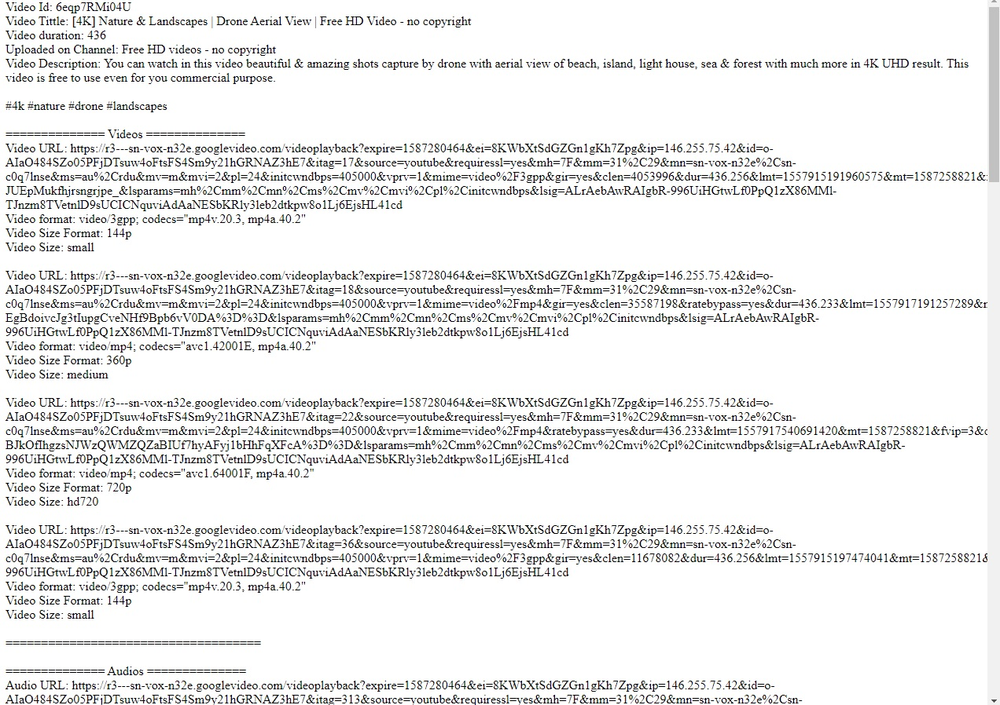

 


**Do you like this project? Support it by donating**

**socialAPIS**

-  Bitcoin: bc1qkauwj52rr6pelckjfq4htgjl7jvamkq5lklqca

# YoutubeDownloader

This is a Youtube Private API Client in PHP

There are multiple other PHP-based youtube downloaders on the Internet, 
but most of them haven't been updated in years, or they depend on youtube-dl itself.  

Every of the, most every downloader uses youtube's front-end, than the extract the data
from youtube front-end response which is kinda [bad];

I wanted to build a java android application to play youtubes videos in background
and i had quite problems with all downloaders on the web.

I mean you have librarys that work, but when youtube changes something on the front-end
they need to update, and yeah, youtube is changing it on a regular monthly bases.

Pure PHP-based youtube downloaders that work, don't exist, except of this one.

This is the first Pure PHP-based youtube downloader that works.

This script does not depend on anything other than cURL.
cURL is used from GuzzleHttp. 
No Javascript interpreters, no calls to shell... nothing but pure PHP with no heavy dependencies either.

Feel free to fork and contribute if you like this project!

## Demo

This will work every time, you can have 1M requests, if youtube blocks you,
just ask the server to register you again, and you have the new key which is not banned.

Here down is a screenshot of [this](./Examples/FetchPlayer.php) example running in browser.



[Here](./docs/ResponseSample.txt) you can see the whole response

Installation
-------

Recommended way of installing this is via [Composer](http://getcomposer.org):

```bash
composer require socialAPIS/youtubedownloader
```

Copy the [FetchPlayer](./Examples/FetchPlayer.php) example to your server folder and run it

# Usage

To use the Youtube's private API you first need to register.
to register you can call this 
```
$registrationResponse = $yt->registerDevice();
```

to save bandwidth you can save the id/key from the response and
save it to a database or any other method.

if you have the id/key, you can register on this way

```
$yt->registerIdKey("id", "key");
```

```php
$yt = new \YoutubeDownloader\YoutubeDownloader();

$registrationResponse = $yt->registerDevice();

//or

$yt->registerIdKey("id", "key");
```

Then you need to have the video id
```
$playerResponse = $yt->playerRequest->fetch_player_info('video_id_comes_here');

//to se some output you can
echo $playerResponse->serializeToJsonString();
```

You will get this output:

```json
{
  "requestData": {
    "googleVisitorId": ""
  },
  "playerVideos": {
    "id": 21540,
    "videos": [
      {
        "id": 17,
        "videoUrl": "https://r3---sn-vox-n32e.googlevideo.com/videoplayback?expire=1587287354&ei=2sCbXqv1KYmK7gOolJDQAw&ip=146.255.75.42&id=o-ADg-JhQhyb5_HLjBIDhsgPBiCE-m1W1TJEE_ut1_j4L9&itag=17&source=youtube&requiressl=yes&mh=7F&mm=31%2C29&mn=sn-vox-n32e%2Csn-c0q7lnse&ms=au%2Crdu&mv=m&mvi=2&pcm2cms=yes&pl=24&pcm2=no&initcwndbps=462500&vprv=1&mime=video%2F3gpp&gir=yes&clen=4053996&dur=436.256&lmt=1557915191960575&mt=1587265652&fvip=3&c=ANDROID&txp=5431432&sparams=expire%2Cei%2Cip%2Cid%2Citag%2Csource%2Crequiressl%2Cpcm2%2Cvprv%2Cmime%2Cgir%2Cclen%2Cdur%2Clmt&sig=AJpPlLswRQIgaBWKonzA2at6trESlwPOkW8391wYbwL5mFuI4BT6sd0CIQD3MT2lvaa75iuEtO6AbC1knTEaQu9L9IuqToZPkljMpA%3D%3D&lsparams=mh%2Cmm%2Cmn%2Cms%2Cmv%2Cmvi%2Cpcm2cms%2Cpl%2Cinitcwndbps&lsig=ALrAebAwRQIgd8KLX0ldFKlRJiY4W9eUFBB6Qhg_HD7aLsF0mjkepsQCIQC8cd38PmQSxaXCiF8rIh_UOb3TxD1DPpuk0MeEJTAeAw%3D%3D",
        "format": "video/3gpp; codecs=\"mp4v.20.3, mp4a.40.2\"",
        "size": "small",
        "sizeFormat": "144p"
      },
      {
        "id": 18,
        "videoUrl": "https://r3---sn-vox-n32e.googlevideo.com/videoplayback?expire=1587287354&ei=2sCbXqv1KYmK7gOolJDQAw&ip=146.255.75.42&id=o-ADg-JhQhyb5_HLjBIDhsgPBiCE-m1W1TJEE_ut1_j4L9&itag=18&source=youtube&requiressl=yes&mh=7F&mm=31%2C29&mn=sn-vox-n32e%2Csn-c0q7lnse&ms=au%2Crdu&mv=m&mvi=2&pcm2cms=yes&pl=24&pcm2=no&initcwndbps=462500&vprv=1&mime=video%2Fmp4&gir=yes&clen=35587198&ratebypass=yes&dur=436.233&lmt=1557917191257289&mt=1587265652&fvip=3&c=ANDROID&txp=5431432&sparams=expire%2Cei%2Cip%2Cid%2Citag%2Csource%2Crequiressl%2Cpcm2%2Cvprv%2Cmime%2Cgir%2Cclen%2Cratebypass%2Cdur%2Clmt&sig=AJpPlLswRQIgW_UDRYl8zmYRNf4fVikpqjenp2l2vMKuiynmChUmCwUCIQD4Q6ggKRo_78nGkXnScL1z9d6Ig4yRap5HKm9QUgyhaw%3D%3D&lsparams=mh%2Cmm%2Cmn%2Cms%2Cmv%2Cmvi%2Cpcm2cms%2Cpl%2Cinitcwndbps&lsig=ALrAebAwRQIgd8KLX0ldFKlRJiY4W9eUFBB6Qhg_HD7aLsF0mjkepsQCIQC8cd38PmQSxaXCiF8rIh_UOb3TxD1DPpuk0MeEJTAeAw%3D%3D",
        "format": "video/mp4; codecs=\"avc1.42001E, mp4a.40.2\"",
        "size": "medium",
        "sizeFormat": "360p"
      },
      ...
}
...
```

## To-do list
- refactor
- Explain the encryption key preparation (Hashing/Encryption)
- Explain the Url and Body Signing process
- Implement Search/Browse video
- Implement Fetching Google-Visitor-id from response
- Implement Interface for persisting data

# License

- Reciprocal Public License 1.5 (RPL-1.5): https://opensource.org/licenses/RPL-1.5

## Legal

This code is in no way affiliated with, authorized, maintained, sponsored or endorsed by Youtube or any of its affiliates or subsidiaries. This is an independent and unofficial API. Use at your own risk.
